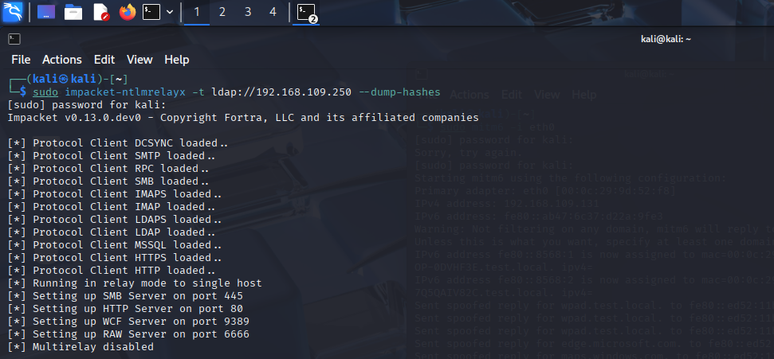
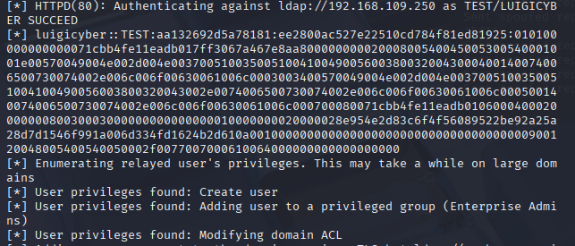

# CyberSecurity Report: NTLM relay attack 

## 1. Introduction

This attack exploits the NTLM authentication protocol, an attacker with Attacker-in-the-middle capabilities is able to gain unauthorized access to network services by relaying authentication requests even without knowing the password or password Hash of the victim. In this scenario the attacker will obtain AiTM capabilities by using a technique called DHCP Spoofing, using a kali-tool called mitm6. After that the attacker will try to relay the NTLM traffic to another service, thus impersonating him.

## 2. Threat Model
The threat model associated with this attack is that the attacker is in the same network as the victim(so he must have done initial access somehow). The objective of the attack in this scenario is to obtain the dump of the hashes of the domain controller.

## 3. Setup

For this lab i have setupped 3 virtual machines on VMware Workstastion Pro:
1. A **Kali Linux** machine (The attacker), in which there is installed **mitm6**, and a tool called **NTLMRelayx** which is part of the impacket toolbox.
2. A **Windows 2019 Server** where I have configured a Domain Server (called test.local) and a DHCP server (I also disabled the default DHCP server of VMware, to avoid conflicts).
3. A **Windows 10 Pro** machine with a domain account logged in.

These three virtual machines are in the same network with ip in the 192.168.109.0/24 subnet. The Windows Server 2019 is configured with a static private ip which is 192.168.109.250.

## 4. Attack Execution
### 4.1 NMAP

First of all the attacker has to understand which hosts are connected to the network. This can be achieved by using a command called **nmap**, which scan the network and provides the ip of a machine and the server processes that are currently running in that machine. 


Where in green is highlighted the ip address of the Windows 10 machine, and in yellow the ip address of the domain controller.

### 4.2 mitm6

Now the attacker has to start a fake DHCPv6 Server. This server take advantage of a windows mechanism that prefer to contact ad IPv6 instead of an IPv4 if it's available.
The DHCPv6 server will advertise a DNS server with IPv6, which correspond to the ip of the kali machine. The attacker can then force the resolution of any name to his address, and so redirect all the traffic he wants obtaining Man-in-the-middle capabilities.
Before starting the mitm6 tool, the configuration in the windows machine is the following:


As we can see, he use a DHCP and a DNS server associated with IPv4 198.168.109.250. Now we run mit6 in kali. We specify the eth-0 network interface of the kali machine.


And as we can see mitm6 is starting to spoof incoming DNS request. On the victim machine now the preffered DNS Ip is shown in the following picture.


### 4.3 NTLMRelayx
Now the attacker has to start up NTLMRelayx tool, which will relay NTLM traffic to the domain controller: 

```bash
Sudo impacket-ntlmrelayx -t ldap://192.168.109.250 --dump-hashes
```



After the execution, it starts loading many client processes ready for impersonating the victim, and also many server processes to bait some user to attempt connection to his machine. Now the attacker needs only to wait for incoming connections.
If for example an user attempt to to resolve an hostname on the network, such as a shared folder path, the client attemtps to resolve the name using his DNS server (in this scenario the DNS server controlled by the attacker), and if the name is not a DNS name (eg. NetBIOS Name) another protocol is used such as LLMNS.  
Let's suppose the victim is trying to access the resources at:
```
\\test.local
```


At this point an NTLM authentication starts, and all his traffic is intercepted by the attacker and relayed to the domain controller. The domain controller is queried, and asked for hash-dumping.



In this case the attacker is lucky because the account he is impersonating is a domain account with administrator privilege, and so is able to receive all the information inside the domain controller (in this case the password hash), and as we can see in the previous image is able to create users, adding user to priviliged groups, or modifying ACL of resources.

## 5. Conclusions
 
This attack exploits the NTLM authentication protocol, even though this protocol was declared not secure by Microsoft it is still being used for compatibility reasons and using other authentication protocol such as Kerberos will be a better option. If the use of this protocol is unavoidable certain precautions should be used, for example:  
1. Activate **Signing & Sealing** feature (by default it's not enabled!)
2. Using **Protected Users** group, in which the account that are inserted cannot authenticate using NTLM.

## References

1. mitm6: [https://www.kali.org/tools/mitm6/](https://www.kali.org/tools/mitm6/)
2. impacket-scripts: [https://www.kali.org/tools/impacket-scripts/](https://www.kali.org/tools/impacket-scripts/)
3. 
